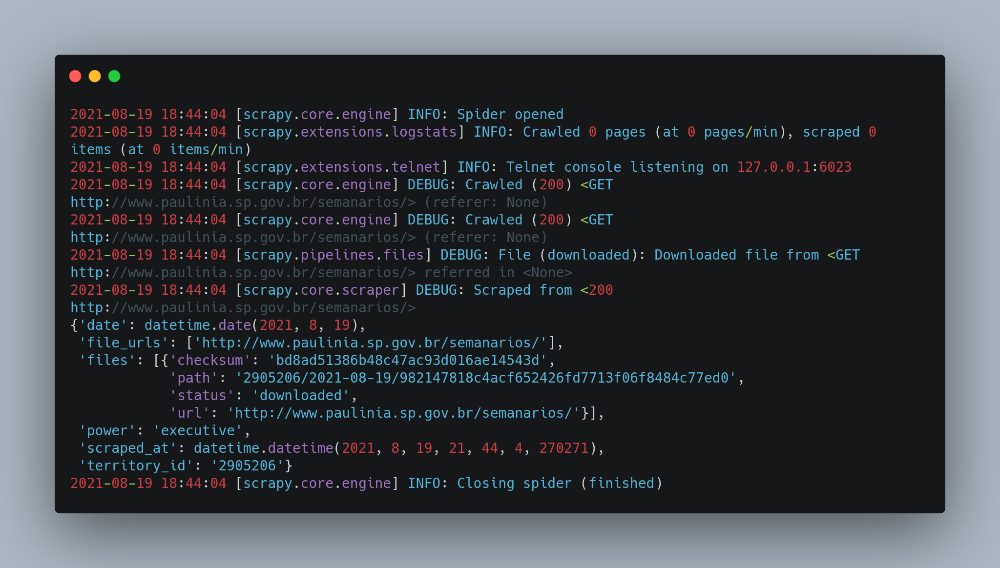
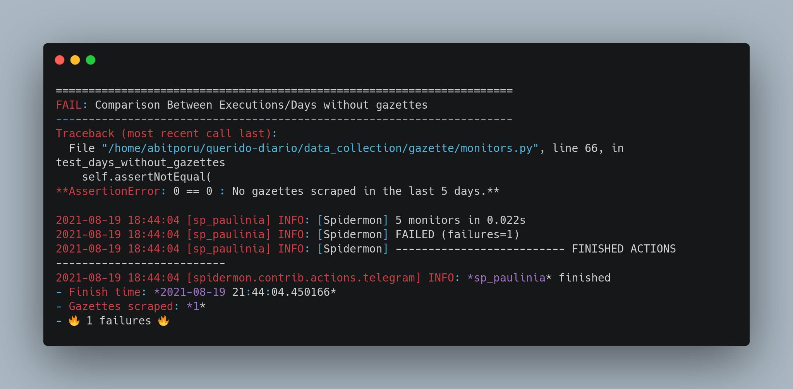
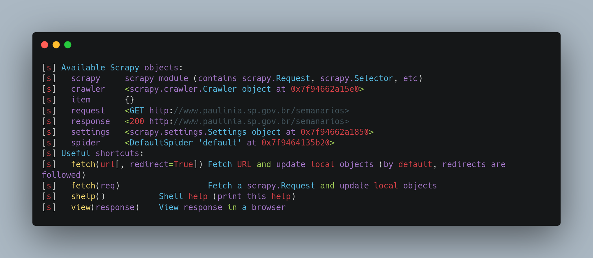

# Raspe um Diário Oficial e contribua com o Querido Diário 🕷️📚

O [Querido Diário](https://queridodiario.ok.org.br/) é um projeto de código aberto da [Open Knowledge Brasil](https://ok.org.br/) que utiliza Python e outras tecnologias para libertar informações do Diário Oficial (DO) das administrações públicas no Brasil. A iniciativa mapeia, baixa e converte todas as páginas das publicações para um formato mais acessível, a fim de facilitar a análise de dados.

Neste tutorial, mostraremos orientações gerais para construir um raspador e contribuir com o projeto Querido Diário.

Se você prefere uma apresentação sobre o projeto em vídeo, confira o workshop [Querido Diário: hoje eu tornei um Diário Oficial acessível](https://escoladedados.org/coda2020/workshop-querido-diario/) da Ana Paula Gomes no [Coda.Br 2020](https://escoladedados.org/coda2020). Ainda que mudanças recentes possam ter alterado detalhes apresentados na oficina, o vídeo é uma ótima complementação a este tutorial. Você pode utilizar a *timestamp* na descrição do vídeo para assistir apenas trechos de seu interesse.

## Sumário 📑
  1. [Colabore com o tutorial](#colabore-com-o-tutorial-)
  2. [Mapeando e escolhendo Diários Oficiais](#mapeando-e-escolhendo-diarios-oficiais-)
  3. [Construindo o raspador](#construindo-o-raspador-)
  4. [Configurando um ambiente de desenvolvimento](#configurando-um-ambiente-de-desenvolvimento-)
  5. [Conhecendo os raspadores](#conhecendo-os-raspadores-)
      1. [Casos particulares](#casos-particulares)
  6. [Anatomia de um raspador](#anatomia-de-um-raspador-)
      1. [Parâmetros iniciais](#parametros-iniciais)
      2. [Parâmetros de saída](#parametros-de-saida)
  7. [Hello world: faça sua primeira requisição](#hello-world-faca-sua-primeira-requisicao-)
  8. [Dissecando o log](#dissecando-o-log-)
  9. [Construindo um raspador de verdade](#construindo-um-raspador-de-verdade-)
      1. [Identificando e testando os seletores](#identificando-e-testando-os-seletores)
      2. [Construindo o código do raspador](#construindo-o-codigo-do-raspador)
      3. [Dicas para testar o raspador](#dcas-para-testar-o-raspador)
  10. [Enviando sua contribuição](#enviando-sua-contribuicao-)
  11. [Tarefas pendentes](#tarefas-pendentes-)

## Colabore com o tutorial 💪

Este documento está em constante construção. Você pode ajudar a melhorar esta documentação fazendo *pull requests* neste repositório.

## Mapeando e escolhendo Diários Oficiais 🔎

Existem formas de colaborar com o Querido Diário sem precisar programar. Você pode participar do [Censo](https://censo.ok.org.br/), por exemplo, e ajudar a mapear os Diários Oficiais de todos os municípios brasileiros.

Se você quiser botar a mão na massa e construir seu raspador, pode começar “adotando” uma cidade. Primeiro, encontre uma cidade que ainda não esteja listada no [arquivo CITIES.md do repositório](https://github.com/okfn-brasil/querido-diario/blob/main/CITIES.md).

O endereço do repositório do projeto é: https://github.com/okfn-brasil/querido-diario/

Antes de começar a trabalhar, vale também dar uma olhada na seção [Issues](https://github.com/okfn-brasil/querido-diario/issues) e [Pull Requests](https://github.com/okfn-brasil/querido-diario/pulls). Assim, você consegue checar se já existe um raspador para a cidade escolhida que ainda não tenha sido incorporado ao projeto (*Pull Requests*) ou se há outras pessoas trabalhando no código para o município (*Issues*).

Se o raspador da sua cidade não consta como feito no [arquivo CITIES.md do repositório](https://github.com/okfn-brasil/querido-diario/blob/main/CITIES.md), não está na seção [Issues](https://github.com/okfn-brasil/querido-diario/issues), nem na aba de [Pull requests](https://github.com/okfn-brasil/querido-diario/pulls), então, crie uma *Issue* nova para anunciar que você irá trabalhar no raspador da cidade escolhida.

## Construindo o raspador 💻

Para acompanhar o tutorial e construir um raspador, é necessário instalar e conhecer algo sobre os seguintes softwares:

- Uso do terminal
- [Python](https://www.python.org/) e o pacote Scrapy
- [Git](https://git-scm.com/) e Github
- HTML,CSS,XPath

Se você não se sente confortável com estas tecnologias, sugerimos a leitura dos seguintes tutoriais primeiro.

- [Tutorial da documentação do Scrapy](https://docs.scrapy.org/en/latest/intro/tutorial.html)

- [Introdução a XPath para raspagem de dados](https://escoladedados.org/tutoriais/xpath-para-raspagem-de-dados-em-html/)

- [Git Handbook](https://guides.github.com/introduction/git-handbook/)

## Configurando um ambiente de desenvolvimento 🌱

[Faça um fork do repositório](https://docs.github.com/pt/github/getting-started-with-github/quickstart/fork-a-repo) do Querido Diário na sua conta no Github.

Em seguida, clone este novo repositório para seu computador e crie uma nova branch para a cidade que irá trabalhar:

```sh
git checkout -b <sigladoestado>-<cidade>
```

Vejamos um exemplo com a cidade Paulínia em São Paulo:

```sh
git checkout -b sp-paulinia
```

Se você usa Windows, baixe as [Ferramentas de Build do Visual Studio](https://visualstudio.microsoft.com/pt-br/downloads/#build-tools-for-visual-studio-2019) e execute o instalador. Durante a instalação, selecione a opção “Desenvolvimento para desktop com C++” e finalize o processo.

Se você usa Linux ou Mac Os, pode simplesmente executar os seguintes comandos. Eles também estão descritos no README do projeto, na parte de configuração de ambiente.

```py
python3 -m venv .venv
source .venv/bin/activate
pip install -r data_collection/requirements.txt
pre-commit install
```

Usuários de Windows devem executar os mesmo comandos, apenas trocando o `source .venv/bin/activate` por `.venv\Scripts\activate.bat`.

## Conhecendo os raspadores 🕷

Todos os raspadores do projeto ficam na pasta [data_collection/gazette/spiders/](https://github.com/okfn-brasil/querido-diario/tree/main/data_collection/gazette/spiders). Navegue por diferentes arquivos e repare no que há de comum e diferente no código de cada um.

Os nomes de todos os arquivos seguem o padrão: **uf_nome_da_cidade.py**.

Ou seja, primeiro, temos a sigla da UF, seguido de _underline_ e nome da cidade. Tudo em minúsculas, sem espaços, acentos ou caracteres especiais e separando as palavras com _underline_.

Para se familiarizar, sugerimos que você navegue por alguns exemplos paradigmáticos de Diários Oficiais:

* **Paginação**: um bom exemplo de raspador onde as publicações estão separadas em várias páginas é o [da cidade de Manaus](https://github.com/okfn-brasil/querido-diario/blob/main/data_collection/gazette/spiders/am_manaus.py).

* **Busca de datas**: outra situação comum é quando você precisa preencher um formulário e fazer uma busca de datas para acessar as publicações. É caso por exemplo do script [ba_salvador.py](https://github.com/okfn-brasil/querido-diario/blob/main/data_collection/gazette/spiders/ba_salvador.py), que raspa as informações da capital baiana.

* **Consulta via APIs**: pode ser também que ao analisar as requisições do site, você descubra uma API escondida, com dados dos documentos já organizadas em um arquivo JSON, por exemplo. É o caso do raspador de [Natal](https://github.com/okfn-brasil/querido-diario/blob/main/data_collection/gazette/spiders/rn_natal.py). Na Escola de Dados, é possível encontrar um webinar sobre [raspagem de dados por meio de "APIs escondidas"](https://escoladedados.org/2021/05/como-descobrir-apis-escondidas-para-facilitar-a-raspagem-de-dados/), que pode ser útil para quem está começando.

### Casos particulares

Você talvez tenha reparado que alguns raspadores praticamente não possuem código e quase se repetem entre si. Neste caso, tratam-se de municípios que compartilham o mesmo sistema de publicação. Então, tratamos eles conjuntamente, modificando apenas o necessário de raspador para raspador, ao invés de repetir o mesmo código em cada arquivo. É o caso, por exemplo, de cidades em Santa Catarina como [**Abdon Batista**](https://github.com/okfn-brasil/querido-diario/blob/main/data_collection/gazette/spiders/sc_abdon_batista.py) e [**Agrolândia**](https://github.com/okfn-brasil/querido-diario/blob/main/data_collection/gazette/spiders/sc_agrolandia.py).

Existem raspadores que não têm nome de cidade pois diversos municípios usam a mesma plataforma para publicar seus Diários Oficiais. São normalmente sites de associações de municípios. É o caso de [**ba_associacao_municipios.py**](https://github.com/okfn-brasil/querido-diario/blob/main/data_collection/gazette/spiders/ba_associacao_municipios.py).

Mas para uma primeira contribuição não se preocupe com esses casos particulares. Vamos voltar ao nosso exemplo e ver como construir um raspador completo para apenas uma cidade.

## Anatomia de um raspador 🧠

Por padrão, todos os raspadores começam importando alguns pacotes. Vejamos quais são:

* `import datetime`: pacote para lidar com datas.
* `from gazette.items import Gazette`: item que será salvo com campos de metadados que devem/podem ser preenchidos.
* `from gazette.spiders.base import BaseGazetteSpider`: é o raspador (spider) base do projeto, que já traz algumas funcionalidades úteis.

### Parâmetros iniciais

Cada raspador traz uma classe em Python, que executa determinadas rotinas para cada página dos sites que publicam Diários Oficiais. Todas as classes possuem pelo menos as informações básicas abaixo:

* `name`: Nome do raspador no mesmo padrão do nome do arquivo, sem a extensão. Exemplo: `sp_paulinia`.
* `TERRITORY_ID`: código da cidade no IBGE. Confira a o arquivo [`territories.csv`](https://github.com/okfn-brasil/querido-diario/blob/main/data_collection/gazette/resources/territories.csv) do projeto para descobrir o código da sua cidade. Exemplo: `2905206`.
* `allowed_domains`: Domínios nos quais o raspador irá atuar. Tenha atenção aos colchetes. Eles indicam que se trata de uma lista, ainda que tenha apenas um elemento. Exemplo: `["paulinia.sp.gov.br"]`
* `start_urls`: lista com URLs de início da navegação do raspador (normalmente apenas uma). A resposta dessa requisição inicial é encaminhada para a variável `response`, do método padrão do Scrapy chamado `parse`. Veremos mais sobre isso em breve. Novamente, atenção aos colchetes. Exemplo:`["http://www.paulinia.sp.gov.br/semanarios/"]`
* `start_date`: Representação de data no formato ano, mês e dia (YYYY, M, D) com `datetime.date`. É a data inicial da publicação do Diário Oficial no sistema questão, ou seja, a data da primeira publicação disponível online. Encontre esta data pesquisando e a insira manualmente nesta variável. Exemplo: `datetime.date(2017, 4, 3)`.

### Parâmetros de saída

Além disso, cada raspador também precisa retornar algumas informações por padrão. Isso acontece usando a expressão `yield` nos itens criados do tipo `Gazette`.

* `date`: A data da publicação do diário. 
* `file_urls`: Retorna as URLs da publicação do DO como uma lista. Um documento pode ter mais de uma URL, mas não é algo comum.
* `power`: Aceita os parâmetros `executive` ou `executive_legislative`. Aqui, definimos se o DO tem informações apenas do poder executivo ou também do legislativo. Para definir isso, é preciso olhar manualmente nas publicações se há informações da Câmara Municipal agregadas no mesmo documento, por exemplo.
* `is_extra_edition`: Sinalizamos aqui se é uma edição extra do Diário Oficial ou não. Edições extras são edições completas do diário que são publicadas fora do calendário previsto.
* `edition_number`: Número da edição do DO em questão.

Vejamos agora nosso código de exemplo.

## Hello world: faça sua primeira requisição 👋

O Scrapy começa fazendo uma requisição para a URL definida no parâmetro `start_urls`. A resposta dessa requisição vai para o método padrão `parse`, que irá armazenar a resposta na variável `response`.

Então, uma forma de fazer um "Hello, world!" no projeto Querido Diário seria com um código como este abaixo.

```python
import datetime
from gazette.items import Gazette
from gazette.spiders.base import BaseGazetteSpider

class SpPauliniaSpider(BaseGazetteSpider):
    name = "sp_paulinia"
    TERRITORY_ID = "2905206"
    start_date = datetime.date(2010, 1, 4)
    allowed_domains = ["paulinia.sp.gov.br"]
    start_urls = ["http://www.paulinia.sp.gov.br/semanarios/"]

    def parse(self, response):
        yield Gazette(
            date=datetime.date.today(),
            file_urls=[response.url],
            power="executive",
        )
```

O código baixa o HTML da URL inicial, mas não descarrega nenhum DO de fato. Definimos este parâmetro como o dia de hoje, apenas para ter uma versão básica operacional do código. Porém, ao construir um raspador real, neste parâmetro você deverá indicar as datas corretas das publicações.

De todo modo, isso dá as bases para você entender como os raspadores operam e por onde começar a desenvolver o seu próprio.

Para rodar o código, você pode seguir as seguintes etapas:

1. Crie um arquivo na pasta `data_collection/gazette/spiders/` do repositório criado no seu computador a partir do seu fork do Querido Diário;
2. Abra o terminal na raíz do projeto;
3. Ative o ambiente virtual, caso não tenha feito antes, como indicado na seção _"[Configurando um ambiente de desenvolvimento](#configurando-um-ambiente-de-desenvolvimento)"_ (`source .venv/bin/activate`, por exemplo);
4. No terminal, vá para a pasta `data_collection`;
5. No terminal, rode o raspador com o comando `scrapy crawl nome_do_raspador` (nome que está no atributo `name` da classe do raspador). Ou seja, no exemplo rodamos: `scrapy crawl sp_paulinia`.

## Dissecando o log 📄

Se tudo deu certo, deve aparecer um log enorme terminal.

Ele começa com algo como `[scrapy.utils.log] INFO: Scrapy 2.4.1 started (bot: gazette)` e traz uma série de informações sobre o ambiente inicialmente. Mas a parte que mais nos interessa começa apenas após a linha `[scrapy.core.engine] INFO: Spider opened` e termina na linha `[scrapy.core.engine] INFO: Closing spider (finished)`. Vejamos abaixo.



A linha `DEBUG: Scraped from <200 http://www.paulinia.sp.gov.br/semanarios/>` nos indica conseguimos acessar o endereço especificado (código 200).

Ao desenvolver um raspador, busque principalmente por avisos de *WARNING* e *ERROR*. São eles que trarão as informações mais importantes para você entender os problemas que ocorrem.

Depois de encerrado o raspador, temos as linhas da seção dos *monitors*, que trará um relatório de execução. É normal que apareçam erros, como este abaixo.


<!-- Imagem gerada no site carbon.now.sh -->

É um aviso que nada foi raspado nos últimos dias. Tudo bem, este é apenas um teste inicial para irmos nos familiarizando com o projeto.

## Construindo um raspador de verdade 🛠️

Aqui, tudo vai depender da forma como cada site é construído. Mas separamos algumas dicas gerais que podem te ajudar.

Primeiro, navegue pelo site para entender a forma como os DOs estão disponibilizados. Busque encontrar um padrão consistente e pouco sucetível a mudanças ocasionais para o robô extrair as informações necessárias. Por exemplo, se as publicações estão separadas em várias abas ou várias páginas, primeiro certifique-se de que todas elas seguem o mesmo padrão. Sendo o caso, então, você pode começar fazendo o raspador para a página mais recente e depois repetir as etapas para as demais, por meio de um loop, por exemplo.

Como vimos, a variável `response` nos retorna todo conteúdo da página inicial do nosso raspador. Ela tem vários atributos, como o `text`, que traz todo HTML da página em questão como uma *string*. Mas não temos interesse em todo HTML da página, apenas em informações específicas, então, todo trabalho da raspagem consiste justamente em separar o joio do trigo para filtrar os dados de nosso interesse. Fazemos isso por meio de seletores CSS, XPath ou expressões regulares.

### Identificando e testando os seletores

Uma forma fácil para testar os seletores do seu raspador é usando o Scrapy Shell. Experimente rodar por exemplo o comando `scrapy shell "http://www.paulinia.sp.gov.br/semanarios"`. Agora, você pode interagir com a página por meio da linha de comando e deve ver os comandos que temos disponíveis.


<!-- Imagem gerada no site carbon.now.sh -->

O elemento mais importante no nosso caso é o `response`. Se o acesso ao site foi feito com êxito, este comando deverá retornar o código 200.

Já o comando `response.css("a")` nos retornaria informações sobre todos os links das página em questão. Também é possível usar o `response.xpath` para identificar os seletores.

O modo mais fácil para de fato identificar os tais seletores que iremos utilizar é por meio do "Inspetor Web". Trata-se de uma função disponível em praticamente todos navegadores navegadores modernos. Basta clicar do lado direito na página e selecionar a opção "Inspecionar". Assim, podemos visualizar o código HTML, copiar e buscar por seletores XPath e CSS.

Experimente rodar o comando `response.xpath("//div[@class='container body-content']//div[@class='row']//a[contains(@href, 'AbreSemanario')]/@href")` e ver os resultados. Este seletor XPath busca primeiro por tags `div` em qualquer lugar da página, que tenha como classe `container body-content`. Dentro destas tags, buscamos então por outras `div` com a classe `row`. E, em qualquer lugar dentro destas últimas, por fim, buscamos por tags `a` (links) cujo atributo `href` contenha a palavra `AbreSemanario` e pedimos para retornar o valor apenas do atributo `href`. 

Existem várias formas de escrever seletores para o mesmo objeto. Você pode ter uma ideia de como montar o seletor inspecionando a página que disponibiliza os DOs.

Se você rodar o comando acima, irá ver uma lista de objetos como este: `<Selector xpath="//div[@class='container body-content']//div[@class='row']//a[contains(@href, 'AbreSemanario')]/@href" data='AbreSemanario.aspx?id=1064'>`.

O que realmente nos interessa é aquilo que está dentro do parâmetro `data`, ou seja, o trecho da URL que nos permite acesso a cada publicação. Então, adicione o `getall()` ao fim do comando anterior: `response.xpath("//div[@class='container body-content']//div[@class='row']//a[contains(@href, 'AbreSemanario')]/@href").getall()`.

Se o objetivo fosse selecionar apenas o primeiro item da lista, poderíamos usar o `.get()`.

Por vezes, pode ser necessário utilizar expressões regulares (regex) para "limpar" os seletores. A [Escola de Dados tem um tutorial sobre o assunto](https://escoladedados.org/tutoriais/expressao-regular-pode-melhorar-sua-vida/) e você vai encontrar diversos outros materiais na internet com exemplos de regex comuns, como este que aborda [expressões para identificar datas](https://www.oreilly.com/library/view/regular-expressions-cookbook/9781449327453/ch04s04.html) - algo que pode ser muito útil na hora de trabalhar com DOs.

Após identificar os seletores, é hora de construir seu raspador no arquivo `.py` da pasta `spiders`.

### Construindo o código do raspador

Normalmente, para completar o seu raspador você precisará fazer algumas requisições extras. É possível identificar quais requisições são necessárias fazer através do "Analizador de Rede" em navegadores. A [palestra do Giulio Carvalho na Python Brasil 2020](https://youtu.be/nhEPZ3r5zGY) mostra como pode ser feita essa análise de requisições de um site para depois converter em um raspador para o Querido Diário.

Se você precisar fazer alguma requisição `GET`, o objeto de requisição `scrapy.Request` deve ser o suficiente. O objeto `scrapy.FormRequest` normalmente é usado para requisições `POST`, que enviam algum dado no `formdata`.

Sempre que uma requisição for feita a partir de uma página, ela é feita utilizando a expressão `yield` e sua resposta será enviada para algum método da classe do raspador. As requisições tem alguns parâmetros essenciais (outros parâmetros podem ser vistos na documentação do Scrapy):

* `url`: A URL da página que será acessada;
* `callback`: O método da classe do raspador para o qual a resposta será enviada (por padrão, o método `parse` é utilizado);
* `formdata` (em `FormRequest`): Um dicionário contendo campos e seus valores que serão enviados.

No exemplo completo para a cidade de Paulínia (SP), na página inicial temos links para todos os anos onde há diários disponíveis e em cada ano todos os diários são listados na mesma página. Então, uma requisição é feita para acessar a página de cada ano (a página inicial já é o ano atual) usando `scrapy.FormRequest` (nesse caso, um método `.from_response` que já aproveita muitas coisas da `response` atual, inclusive a própria URL). A resposta dessa requisição deve ir para o método `parse_year` que irá extrair todos os metadados possíveis de ser encontrados na página. Com isso, a extração dos diários de Paulínia está completa 😄.

Veja como fica o raspador no exemplo a seguir (com comentários para explicar algumas partes do código):

```python
# Importação dos pacotes necessários
import datetime
import scrapy
from gazette.items import Gazette
from gazette.spiders.base import BaseGazetteSpider

# Definição da classe do raspador
class SpPauliniaSpider(BaseGazetteSpider):

# Parâmetros iniciais
    name = "sp_paulinia"
    TERRITORY_ID = "2905206"
    start_date = datetime.date(2010, 1, 4)
    allowed_domains = ["www.paulinia.sp.gov.br"]
    start_urls = ["http://www.paulinia.sp.gov.br/semanarios"]

    # O parse abaixo irá partir da start_url acima
    def parse(self, response):
        # Nosso seletor cria uma lista com os código HTML onde os anos estão localizados
        years = response.css("div.col-md-1")
        # E fazer um loop para extrair de fato o ano
        for year in years:
            # Para cada item da lista (year) vamos pegar (get) um seletor XPath.
            # Também dizemos que queremos o resultado como um número inteiro (int)
            year_to_scrape = int(year.xpath("./a/font/text()").get())

            # Para não fazer requisições desnecessárias, se o ano já for o da página
            # inicial (página inicial é o ano atual) ou então for anterior ao ano da
            # data inicial da busca, não iremos fazer a requisição
            if (
                year_to_scrape < self.start_date.year
                or year_to_scrape == datetime.date.today().year
            ):
                continue

            # Com Scrapy é possível utilizar regex direto no elemento com os métodos
            # `.re` e `.re_first` (na maioria das vezes é suficiente e não precisamos
            # usar métodos da biblioteca `re`)
            event_target = year.xpath("./a/@href").re_first(r"(ctl00.*?)',")

            # O método `.from_response` nesse caso é bem útil pois pega vários
            # elementos do tipo <input> que já estão dentro do elemento <form>
            # localizado na página e preenche eles automaticamente no formdata, assim
            # é possível economizar muitas linhas de código
            yield scrapy.FormRequest.from_response(
                response,
                formdata={"__EVENTTARGET": event_target},
                callback=self.parse_year,
            )

        # O `yield from` permite fazermos `yield` em cada resultado do método gerador
        # `self.parse_year`, assim, aqui estamos dando `yield` em todos os itens
        # `Gazette` raspados da página inicial
        yield from self.parse_year(response)

    def parse_year(self, response):
        editions = response.xpath(
            "//div[@class='container body-content']//div[@class='row']//a[contains(@href, 'AbreSemanario')]"
        )

        for edition in editions:
            document_href = edition.xpath("./@href").get()

            title = edition.xpath("./text()")

            gazette_date = datetime.datetime.strptime(
                title.re_first(r"\d{2}/\d{2}/\d{4}"), "%d/%m/%Y"
            ).date()
            edition_number = title.re_first(r"- (\d+) -")
            is_extra_edition = "extra" in title.get().lower()

            # Esse site "esconde" o link direto do PDF por trás de uma série de
            # redirecionamentos, porém, como nas configurações do projeto é permitido
            # que arquivos baixados sofram redirecionamento, é possível colocar o link
            # "falso" já no item `Gazette` e o projeto vai conseguir baixar o documento
            yield Gazette(
                date=gazette_date,
                edition_number=edition_number,
                file_urls=[response.urljoin(document_href)],
                is_extra_edition=is_extra_edition,
                power="executive",
            )
```

No final do processo, teste seu raspador usando:

```
scrapy crawl nome_do_raspador
```

### Dicas para testar o raspador

Para ajudar a debugar eventuais problemas na construção do código, você pode inserir a linha `import pdb; pdb.set_trace()` em qualquer trecho do raspador para inspecionar seu código (contexto, variáveis, etc.) durante a execução.

É possível testar o raspador sem baixar nenhum arquivo adicionando `-s FILES_STORE=""` ao comando. Isso é útil para testar rápido se todas as requisições estão funcionando.

Também podemos adicionar os itens extraídos para um arquivo com `-o output.csv` (ou outra extensão como `.json` ou `.jsonlines`), tornando possível analisar de forma bem mais fácil se o que está sendo raspado está correto.

Se o log estiver muito grande, é possível adicioná-lo a um arquivo de texto adicionando `-s LOG_FILE=logs.txt` ao comando, fazendo com que possíveis erros não passem despercebidos.

Também é muito importante testar se o filtro de data no raspador está funcionando. Utilizando o argumento `start_date`, apenas as requisições necessárias para extrair documentos a partir da data desejada devem ser feitas. Este teste pode ser feito com `-a start_date=2020-12-01` (para publicações a partir de 1 de dezembro de 2020). O atributo `start_date` do raspador é utilizado internamente, então se o argumento não for passado, o padrão (primeira data de publicação) é utilizado no lugar.

Como exemplo de uso de todas a opções anteriores em `sp_paulinia` a partir de 1 de dezembro de 2020:

```
scrapy crawl sp_paulinia -a start_date=2020-12-01 -s FILES_STORE="" -s LOG_FILE=logs.txt -o output.json
```

## Enviando sua contribuição 🤝

Ao fazer o commit do código, mencione a issue do raspador da sua cidade. Você pode incluir uma mensagem como `Close #20`, por exemplo, onde #20 é o número identificador da issue criada. Também adicione uma descrição comentando suas opções na hora de desenvolver o raspador ou eventuais incertezas.

Normalmente adicionar apenas um raspador necessita apenas de um único commit. Mas, se for necessário mais de um commit, tente manter um certo nível de separação entre o que cada um está fazendo e também se certifique que suas mensagens estão bem claras e correspondendo ao que os commits realmente fazem.

Uma boa prática é sempre atualizar a ramificação (_branch_) que você está desenvolvendo com o que está na `main` atualizada do projeto. Assim, se o projeto teve atualizações, você pode resolver algum conflito antes mesmo de fazer o Pull Request.

Qualquer dúvida, abra o seu Pull Request em modo de rascunho (_draft_) e relate suas dúvidas para que pessoas do projeto tentem te ajudar 😃. O [canal de discussões no Discord](https://discord.com/invite/nDc9p4drm4) também é aberto para tirar dúvidas e trocar ideias.

## Tarefas pendentes ✔️
- [ ] Melhorar a seção [Construindo um raspador de verdade](#construindo-um-raspador-de-verdade-)
- [ ] Revisar e incorporar conteúdos faltantes (e atuais) citados no artigo do [Vanz](http://jvanz.com/como-funciona-o-robozinho-do-serenata-que-baixa-os-diarios-oficiais.html).
- [ ] Revisar e incorporar conteúdos faltantes (e atuais) citados no [post](https://www.anapaulagomes.me/pt-br/2020/10/quero-tornar-di%C3%A1rios-oficiais-acess%C3%ADveis.-como-come%C3%A7ar/) feito pela Ana Paula Gomes.
