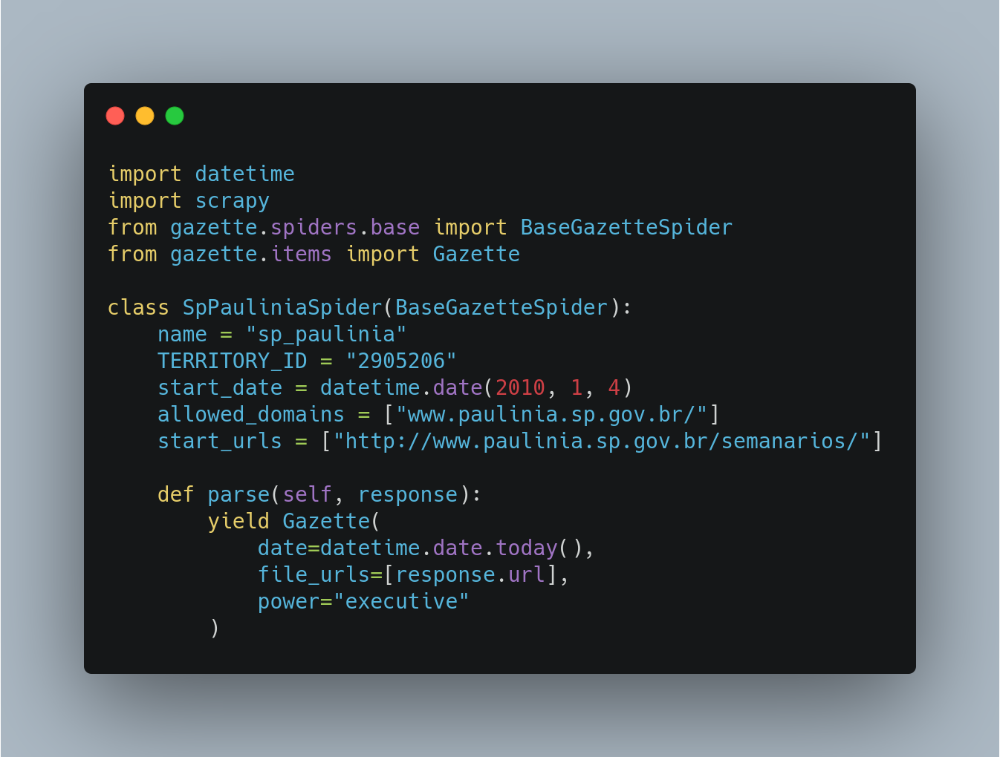

# 🕷️📚 Raspe um Diário Oficial e contribua com o Querido Diário

O [Querido Diário](https://queridodiario.ok.org.br/) é um projeto de código aberto da [Open Knowledge Brasil](https://ok.org.br/) que utiliza Python e outras tecnologias para libertar informações do Diário Oficial (DO) das administrações públicas no Brasil. A iniciativa mapeia, baixa e converte todas as páginas das publicações para um formato mais acessível, a fim de facilitar a análise de dados.

Neste tutorial, mostraremos algumas orientações gerais para construir um raspador e contribuir com o projeto Querido Diário. 

## Colabore com o tutorial

Este é repositório ainda está em fase de elaboração. Abaixo, estão algumas tarefas ainda pendentes. Você pode ajudar melhorando a documentação por meio de *pull requests* neste repositório. Confira a lista de tarefas pendentes no final do documento.

Se você prefere uma apresentação sobre o projeto em vídeo, confira o workshop [Querido Diário: hoje eu tornei um Diário Oficial acessível](https://escoladedados.org/coda2020/workshop-querido-diario/) da Ana Paula Gomes no Coda.Br 2020.

## 🔎 Mapeando os Diários Oficiais
Existem formas de colaborar com o Querido Diário sem precisar programar. Você pode participar de nosso Censo, por exemplo, e ajudar a mapear os Diários Oficiais de todos os municípios brasileiros.

Se você quiser botar a mão na massa e construir seu raspador, pode começar “adotando” uma cidade. Primeiro, encontre uma cidade que ainda não esteja listado no [arquivo CITIES.md do repositório](https://github.com/okfn-brasil/querido-diario/blob/main/CITIES.md). 

O endereço do repositório do projeto é: https://github.com/okfn-brasil/querido-diario/

Para acompanhar o tutorial e construir um raspador, é necessário algum conhecimento sobre:

- Uso do terminal
- Python e o pacote Scrapy
- Git e Github
- HTML,CSS, XPath

### Pareceu grego?

Se você não se sente confortável com estas tecnologias, sugerimos a leitura dos seguintes tutoriais primeiro.

- [Tutorial da documentação do Scrapy](https://docs.scrapy.org/en/latest/intro/tutorial.html)

- [Introdução a XPath para raspagem de dados](https://escoladedados.org/tutoriais/xpath-para-raspagem-de-dados-em-html/)


## 🌱 Configurando um ambiente de desenvolvimento
Faça um fork do repositório oficial do Querido Diário na sua conta no Github.

Em seguida, clone este novo repositório para seu computador.

Se você usa Windows, baixe as [Ferramentas de Build do Visual Studio](https://visualstudio.microsoft.com/pt-br/downloads/#build-tools-for-visual-studio-2019) e execute o instalador. Durante a instalação, selecione a opção “Desenvolvimento para desktop com C++” e finalize o processo.

Se você usa Linux ou Mac Os, pode simplesmente executar os seguintes comandos. Eles também estão descritos no README do projeto, na parte de configuração de ambiente.

```
python3 -m venv .venv
source .venv/bin/activate
pip install -r data_collection/requirements.txt
pre-commit install
```

Usuários de Windows devem executar os mesmo comandos, apenas trocando o segundo deles por:  `.venv\Scripts\activate.bat`


## 🕷 Conhecendo os raspadores

Todos os raspadores do projeto ficam na pasta [data_collection/gazette/spiders/](https://github.com/okfn-brasil/querido-diario/tree/main/data_collection/gazette/spiders). Navegue por diferentes arquivos e repare no que há de comum e diferente no código de cada um.

Os nomes de todos os arquivos seguem o padrão: **uf_nomedacidade.py**. 

Ou seja, primeiro, temos a sigla da UF, seguido de underline e nome da cidade. Tudo em minúsculas, sem espaços, acentos ou caracteres especiais.

Veja alguns exemplos paradigmáticos de Diários Oficiais:

* **Paginação**: um bom exemplo de raspador de DO onde as publicações estão separadas em várias páginas é o [script da cidade de Manaus](https://github.com/okfn-brasil/querido-diario/blob/main/data_collection/gazette/spiders/am_manaus.py).

* **Busca de datas**: outra situação comum é quando você precisa preencher um formulário e fazer uma busca de datas para acessar as publicações. É caso por exemplo do script [ba_salvador.py](https://github.com/okfn-brasil/querido-diario/blob/main/data_collection/gazette/spiders/ba_salvador.py), que raspa as informações da capital baiana.

* **Consulta via APIs**: pode ser também que os dados sobre as publicações estejam disponíveis via API, já organizados em um arquivo JSON. É o caso do raspador de [Natal](https://github.com/okfn-brasil/querido-diario/blob/main/data_collection/gazette/spiders/rn_natal.py).

Se você navegou pelos raspadores, talvez tenha reparado que alguns códigos possuem apenas os metadados. Neste caso, tratam-se de municípios que compartilham o mesmo sistema de publicação. Então, tratamos eles conjuntamente, como associações de municípios, ao invés de repetir o mesmo raspador em cada arquivo.

Mas não se preocupe com isso, por ora. Vamos voltar ao nosso exemplo e ver como construir um raspador completo individualmente.

## 🧠 Anatomia de um raspador



<!-- Imagem gerada no site carbon.now.sh -->

Por padrão, todos os raspadores começam importando alguns pacotes. Vejamos quais são.

`import datetime`: pacote para lidar com datas.

`import scrapy`: quem faz quase toda mágica acontecer. É o pacote utilizado para construir nossos raspadores.

`from gazette.spiders.base import BaseGazetteSpider`: é o raspador (spider) base do projeto, que já traz várias funcionalidades úteis.

### Parâmetros inicias

Cada raspador traz uma classe em Python, que executa determinadas rotinas para cada URL de Diários Oficiais. Todas as classes possuem pelo menos as informações básicas abaixo.

Vejamos um exemplo a partir da cidade Paulínia em São Paulo.

`name` = Nome do raspador no mesmo padrão do nome do arquivo, sem a extensão. Exemplo: `sp_paulinia`.

`TERRITORY_ID` = código da cidade no IBGE. Confira esta tabela da Wikipedia para descobrir o código da sua cidade. Exemplo: `2905206`.

`allowed_domains` = Domínios nos quais o raspador irá atuar. Exemplo: `["www.paulinia.sp.gov.br/"]`

`start_urls` = URL de início da navegação do raspador. A resposta dessa requisição inicial é encaminhada para a variável response, do método padrão do Scrapy chamado parse. Veremos mais sobre isso em breve. Exemplo:`["http://www.paulinia.sp.gov.br/semanarios/"]`

`start_date` = Representação de data no formato ano, mês e dia (YYYY, M, D), usando o pacote datetime. É a data inicial da publicação do Diário Oficial no sistema questão, ou seja, a data da primeira publicação disponível online. Encontre esta data pesquisando e inserindo essa data manualmente nesta variável. Exemplo: `datetime.date(2017, 4, 3)`.

### Parâmetros de saída

Além disso, cada raspador também precisa retornar algumas informações por padrão. Isso acontece usando a função `yield`.

`date` = A data da publicação em questão. Em nosso código de exemplo, definimos este parâmetro como o dia de hoje, apenas para ter uma versão básica operacional do código. Porém, ao construir um raspador real, neste parâmetro você deverá indicar as datas corretas das publicações.

`file_urls` = Retorna a URL das publicações do DO. 

`power` = Aceita os parâmetros `executive` ou `executive_legislative`. Aqui, definimos se o DO tem informações apenas do poder executivo ou também do legislativo. Para definir isso, é preciso olhar manualmente nas publicações se há informações da Câmara Municipal agregadas no mesmo documento, por exemplo.

`is_extra_edition` = Sinalizamos aqui se é uma edição extra do Diário Oficial ou não.

`edition_number` = Número da edição do DO em questão.

Vejamos novamente nosso código de exemplo.

# 👋 Hello world: faça sua primeira requisição

O Scrapy começa fazendo uma requisição para a URL definida no parâmetro `start_urls`. A resposta dessa requisição vai para o método padrão `parse`, que irá armazenar a resposta na variável `response`.

A variável `response` tem vários atributos, como o `text`, que traz o HTML da página em questão como uma *string*.

Então, você pode uma forma de fazer um famoso "Hello, world!" no projeto Querido Diário seria com um código mais ou menos como este abaixo. Você encontra o código visto acima no arquivo [sp_paulinia.py](sp_paulina.py), presente neste repositório. Este código não baixa nenhum DO de fato, mas dá as bases para você entender como os raspadores operam e por onde começar a desenvolver o seu próprio.

Para testar um raspador e começar a desenvolver o seu, siga as seguintes etapas:

1. Importe o arquivo para a pasta `data_collection/gazette/spiders/` no repositório criado no seu computador.
2. Abra o terminal nesta pasta.
3. Ative o ambiente virtual, caso não tenha feito antes. Rode `source .venv/bin/activate` ou o comando adequado na pasta onde o ambiente foi criado.
4. No terminal, rode o raspador com o comando `scrapy crawl nomedoraspador`. Ou seja, no exemplo rodamos: `scrapy crawl sp_paulinia`.

# 📄 Dissecando o arquivo log

Se tudo deu certo, deve aparecer um arquivo de log enorme terminal. 

Ele começa com **[scrapy.utils.log] INFO: Scrapy 2.4.1 started (bot: gazette)** e traz uma série de informações sobre o ambiente inicialmente. Mas a parte que mais nos interessa começa apenas após a linha **[scrapy.core.engine] INFO: Spider opened** e termina na linha **[scrapy.core.engine] INFO: Closing spider (finished)**. Vejamos abaixo.


A linha `DEBUG: Scraped from <200 http://www.paulinia.sp.gov.br/semanarios/>` nos indica conseguimos acessar o endereço especificado (código 200).

Ao desenvolvedor um raspador, busque principalmente por avisos de *WARNING* e *ERROR*. São eles que trarão as informações mais importantes para você entender os problemas que ocorrem.

Depois de encerrado o raspador, temos a linha a seção do *MONITORS*, que trará um relatório de execução. É normal que apareçam erros, como este abaixo.

```
======================================================================
FAIL: Comparison Between Executions/Days without gazettes
----------------------------------------------------------------------
Traceback (most recent call last):
  File "/home/abitporu/querido-diario/data_collection/gazette/monitors.py", line 66, in test_days_without_gazettes
    self.assertNotEqual(
**AssertionError: 0 == 0 : No gazettes scraped in the last 5 days.**

2021-08-19 18:44:04 [sp_paulinia] INFO: [Spidermon] 5 monitors in 0.022s
2021-08-19 18:44:04 [sp_paulinia] INFO: [Spidermon] FAILED (failures=1)
2021-08-19 18:44:04 [sp_paulinia] INFO: [Spidermon] -------------------------- FINISHED ACTIONS --------------------------
2021-08-19 18:44:04 [spidermon.contrib.actions.telegram] INFO: *sp_paulinia* finished
- Finish time: *2021-08-19 21:44:04.450166*
- Gazettes scraped: *1*
- 🔥 1 failures 🔥
```

Basicamente, estamos sendo avisados que nada foi raspado nos últimos dias. Tudo bem, este é apenas um teste inicial para irmos nos familiarizando com o projeto.

# 🛠️ Construindo um raspador de verdade

Aqui, tudo vai depender da forma como cada site é construído. Mas separamos algumas dicas gerais que podem te ajudar.

Primeiro, identifique um seletor que retorne todas as publicações separadamente. Se as publicações estão separadas em várias abas ou várias páginas, primeiro certifique-se de que todas elas seguem o mesmo padrão. Sendo o caso, então, você pode começar fazendo o raspador para a página mais recente e depois repetir as etapas para as demais, por meio de um loop, por exemplo.

Para testar os seletores e construir o raspador, você pode utilizar algumas destas alternativas:

* Inspetor Web: disponível nos navegadores, permite a busca por seletores XPath.
  
* Scrapy shell: você também pode testar seus seletores usando o Scrapy Shell. Experimente rodar por exemplo `scrapy shell "http://www.paulinia.sp.gov.br/semanarios"`. Neste terminal, você pode rodar códigos como `response.xpath("//div[@class='container body-content']//div[@class='row']//a[contains(@href, 'AbreSemanario')]")` e ver os resultados.

* Python debuger: insira a linha `import pdb; pdb.set_trace()` em meio a um loop para testar seu código durante a execução.

# Enviando sua contribuição

## Fazendo um commit

## Compartilhando um raspador parcialmente completo

## Compartilhando um raspador completo

# Tarefas pendentes

Se tiver dúvidas sobre algo, abra uma **issue** neste repositório.

- [ ] Completar a lista de tutoriais introdutórios com materiais relevantes
- [ ] Testar e reportar eventuais problemas com a configuração de ambiente no Windows
- [ ] Testar e reportar eventuais problemas com a configuração de ambiente no Linux
- [ ] Testar e reportar eventuais problemas com a configuração de ambiente no Mac OS
- [ ] Documentar o processo de fazer um commit no repositório e problemas comuns
- [ ] Fazer uma seção mostrando como enviar o seu raspador depois de feito
- [ ] Melhorar a seção "Construindo um raspador de verdade".
- [ ] Melhorar dicas para debugar o código.
- [ ] Revisar e incorporar conteúdos faltantes (e ainda atuais) citados no artigo do [Vanz](http://jvanz.com/como-funciona-o-robozinho-do-serenata-que-baixa-os-diarios-oficiais.html).
- [ ] Revisar e incorporar conteúdos faltantes (e ainda atuais) citados no [post](https://www.anapaulagomes.me/pt-br/2020/10/).quero-tornar-di%C3%A1rios-oficiais-acess%C3%ADveis.-como-come%C3%A7ar/) e na apresentação no [Coda.Br 2020](https://escoladedados.org/coda2020/workshop-querido-diario/) feito por Ana Paula Gomes.
